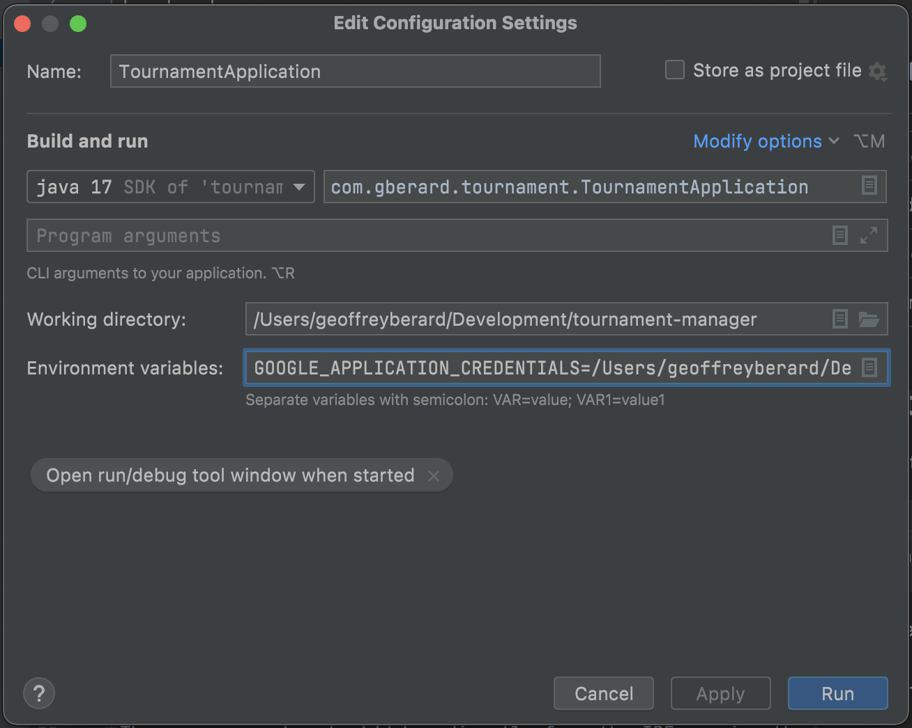

# Requirements
- `node` [installation](https://nodejs.org/en/download/)
- `java jdk17` [installation](https://docs.oracle.com/en/java/javase/17/install/installation-jdk-macos.html#GUID-2FE451B0-9572-4E38-A1A5-568B77B146DE)
- `maven` [installation](https://maven.apache.org/install.html)

# Production
|Service|Url|
|---|---|
|Web App|https://geofberard.github.io/tournament-manager/|
|Api|https://scuf-tournois-prod.uc.r.appspot.com/api/swagger-ui/index.html|

# API Server
## Overview
|||
|---|---|
|Language|[Java](https://www.java.com/fr/)|
|Code Location|`back/`|
|Building Tool|[Maven](https://maven.apache.org)|
|Framework|[Spring Boot](https://spring.io/projects/spring-boot)|

## Set Up
To install all dependencies, run :
```
$ cd back
$ mvn clean install
```
As the server requires access to services APIs in Google Cloud Platform, it needs to run using a `service account`.
To configure it :
- download a service account json token from GCP
- put it in `back/src/main/resources/com/gberard/tournament/`
- pass it to the application using the environment variable `GOOGLE_APPLICATION_CREDENTIALS` :
```
GOOGLE_APPLICATION_CREDENTIALS=<path_to_project>/back/src/main/resources/com/gberard/tournament/credentials.json
```
Using IntelliJ, the runner should look like this :



## Start local environment
The server can be start/debug directly from the IDE running the `main` method in the `TournamentApplication` class.
However, it is possible to run it in terminal with the command :
```
$ mvn spring-boot:run
```

# Web App
## Overview
|||
|---|---|
|Language|[ReactJS](https://fr.reactjs.org/)|
|Code Location|`front/`|
|Building Tool|[Webpack](https://webpack.js.org/)|
|Design System|[Material UI](https://mui.com/material-ui/getting-started/overview/)|

## Set Up
To install all dependencies, run :  
```
$ cd front
$ npm install
```

## Start local environment
To run locally the React App and the Java server locally :
```
$ npm run start:local-api
```

To run locally the React App only and to use staging API (running on google cloud platform here [scuf-tournois-prod.uc.r.appspot.com](https://scuf-tournois-prod.uc.r.appspot.com/api/swagger-ui/index.html):
```
$ npm run start:remote-api
```

## Before commit
To ensure the code quality, run prettier before commiting 
```
$ npm run lint:fix
$ npm run prettier
```

## Deployment
The WebApp is hosted on github `gh-pages`, all the code merge in `main`branch is automatically deployed.